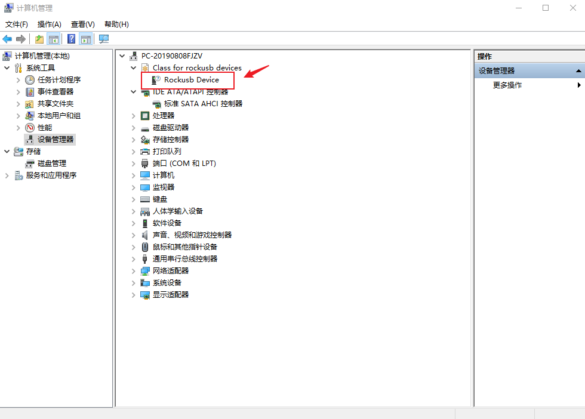
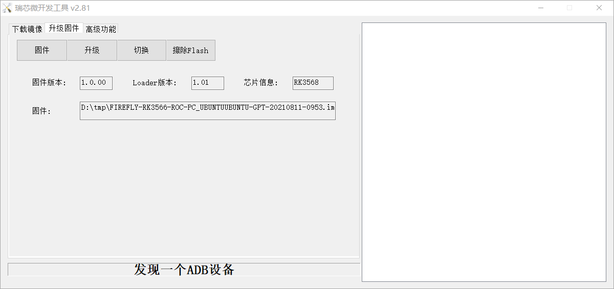

# 编译 Ubuntu 固件
参考：[ROC-RK3566-PC Manual](https://wiki.t-firefly.com/zh_CN/ROC-RK3566-PC/linux_compile_gpt.html)

推荐在 Ubuntu 18.04 系统环境下进行开发，若使用其它系统版本，可能需要对编译环境做相应调整。
*ps：ubuntu20.04 和debian环境下均会有各种各样依赖包的问题，建议直接使用ubuntu 18.04*

## 准备工作
### 搭建编译环境
```sh
sudo apt-get install repo git ssh make gcc libssl-dev liblz4-tool \
expect g++ patchelf chrpath gawk texinfo chrpath diffstat binfmt-support \
qemu-user-static live-build bison flex fakeroot cmake gcc-multilib g++-multilib \
unzip device-tree-compiler python-pip ncurses-dev python-pyelftools
```
### 下载 Firefly_Linux_SDK 分卷压缩包
**由于 Firefly_Linux_SDK 源码包比较大，部分用户电脑不支持4G以上文件或单个文件网络传输较慢, 所以我们采用分卷压缩的方法来打包 SDK。用户可以通过如下方式获取 Firefly_Linux_SDK 源码包：[Firefly_Linux_SDK源码包](https://www.t-firefly.com/doc/download/106.html#other_447)**

**！！！ 这里编译的机器预留空间至少60G**

下载完成后先验证一下 MD5 码：
> md5sum rk356x_linux_release_v1.0.0_20210511_split_dir/*firefly_split*
```sh
1b3d82cc51a241aa3be3c2bb3a6768f4  rk356x_linux_release_v1.0.0_20210511_split_dir/rk356x_linux_release_v1.0.0_20210511_firefly_split.file0
873a83f7dee6f73643352fbc849f497e  rk356x_linux_release_v1.0.0_20210511_split_dir/rk356x_linux_release_v1.0.0_20210511_firefly_split.file1
4b51f7ec0e4b4acfad2ab78d94bec564  rk356x_linux_release_v1.0.0_20210511_split_dir/rk356x_linux_release_v1.0.0_20210511_firefly_split.file2
ad9b9dcfcf2aabb3b7c67a9d1a031e1d  rk356x_linux_release_v1.0.0_20210511_split_dir/rk356x_linux_release_v1.0.0_20210511_firefly_split.file3
d0959117aabb56c0477fd64b9f2dcd4d  rk356x_linux_release_v1.0.0_20210511_split_dir/rk356x_linux_release_v1.0.0_20210511_firefly_split.file4
```
确认无误后，就可以解压：
```sh
mkdir ~/proj/
cd ~/proj/
cat path/to/rk356x_linux_release_v1.0.0_20210511_split_dir/*firefly_split* | tar -xzv
```
### 同步代码
执行如下命令同步代码：
```sh
# 进入 SDK 根目录
cd ~/proj/rk356x_linux_release_20210511/

# 同步
.repo/repo/repo sync -l
.repo/repo/repo sync -c --no-tags
.repo/repo/repo start firefly --all
```
后续可以使用以下命令更新 SDK：
```sh
.repo/repo/repo sync -c --no-tags
```
因为网络环境等原因，.repo/repo/repo sync -c --no-tags 命令更新代码可能会失败，可多次反复执行。

## 编译 SDK
### 编译前配置
在 device/rockchip/rk356x/ 目录下，有不同板型的配置文件，选择配置文件：
```sh
# 进入刚解压的目录
./build.sh firefly-rk3566-roc-pc_ubuntu.mk
```
配置文件会链接到 device/rockchip/.BoardConfig.mk，检查该文件可以验证是否配置成功。

相关配置介绍：
```sh

# Target arch
export RK_ARCH=arm64 # 64位 ARM 架构
# Uboot defconfig
export RK_UBOOT_DEFCONFIG=firefly-rk3566 # u-boot 配置文件
# Kernel defconfig
export RK_KERNEL_DEFCONFIG=firefly_linux_defconfig # kernel 配置文件
# Kernel dts
export RK_KERNEL_DTS=rk3566-firefly-roc-pc # dts 文件
# parameter for GPT table
export RK_PARAMETER=parameter-ubuntu-fit.txt # 分区表
# rootfs image path
export RK_ROOTFS_IMG=ubuntu_rootfs/rk356x_ubuntu_rootfs.img # 根文件系统路径

# 这里打开 device/rockchip/.BoardConfig.mk 发现里面内容和这里的配置介绍有些不一样，我没有管，不影响后面编译
```

### 编译
```sh
# 编译 u-boot
./build.sh uboot

# 编译 kernel
./build.sh kernel

# 编译 recovery
./build.sh recovery 
```
## 下载 Ubuntu 根文件系统
下载根文件系统：[Ubuntu 根文件系统(64位)](https://www.t-firefly.com/doc/download/106.html#other_448)，解压之后放到 SDK 相应路径下
```sh
# 在编译主目录建立 ubuntu_rootfs
mkdir ubuntu_rootfs

# 将下载解压后ubuntu跟文件系统放在相应路径
mv ubuntu-aarch64-rootfs.img ubuntu_rootfs/rk356x_ubuntu_rootfs.img
```

## 打包固件
```sh
# 在编译主目录运行

./mkfirmware.sh # 更新各部分镜像链接到 rockdev/ 目录

./build.sh updateimg # 打包固件，生成的完整固件会保存到 rockdev/pack/ 目录。
```

ps: 后面如果是修改部分文件可以使用全自动编译命令，自动执行以上上述编译、打包操作，生成完整固件。
> ./build.sh


# 烧录固件
将打包好的固件烧录进ROC-RK3566开发板，[官方技术文档](https://wiki.t-firefly.com/zh_CN/ROC-RK3566-PC/03-upgrade_firmware.html)进行了详细说明，以下对windows下烧入固件进行说明，至于linux下烧入固件，如果有需要，可以自行阅读官方技术文档。

## 安装 RK USB 驱动
下载 [Release_DriverAssistant.zip](https://www.t-firefly.com/doc/download/106.html#other_432)，解压，然后运行里面的 DriverInstall.exe 。为了所有设备都使用更新的驱动，请先选择驱动卸载，然后再选择驱动安装。

## 连接设备
### 设备通过硬件方式进入升级模式如下：
- 先断开 Type-C 数据线连接：

    - 按住设备上的 RECOVERY （恢复）键（靠近耳机处)并保持

    - 接上 Type-C 数据线

    - 大约两秒钟后，松开 RECOVERY 键

### 设备通过软件方式进入升级模式如下：
- 使用Type-C 数据线接好开发板 
- 下载 [adb.zip](http://www.t-firefly.com/share/index/index/id/6afafdf7c54b8eb95e81156d94e54db5.html)，解压到后进入该目录，右键进去cmd或者git bash
- 使用 adb shell 命令进入开发板shell
- 执行 reboot loader 命令，进入升级模式

设备管理器出现如下设备，说明进入成功


## 烧写固件
工具: [Androidtool_xxx](https://www.t-firefly.com/doc/download/106.html#other_431)(版本号)

下载工具解压后，右键管理员运行 RKDevTool
点击升级固件->升级，选择之前编译好的固件


点击升级即可！

# 遇到板子无法烧入固件，也无法擦除固件的解决方案
产生原因：板子有两个存储器，在给板子刷固件时进错了模式（loader模式和EMCC模式），将固件刷错存储器

解决办法：[切换升级存储器](https://wiki.t-firefly.com/zh_CN/ROC-RK3566-PC/03-upgrade_firmware_with_flash.html)
