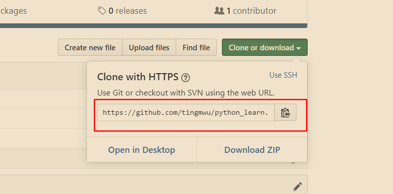

# git 使用

*学习git的基本使用*

## 1. 创建仓库

### 方式 1 git init

*任意建立一个文件夹，右键git bash, 输入git init将会在创建当前文件夹为一个本地git仓库*

> $ mkdir test  
> $ cd test   
> $ git init  

### 方式 2 git clone 

*直接将git仓库中的在线仓库克隆到本地*

> $ git clone xxxxx  

*xxxxx是你在仓库复制的链接，如下图所示*

## 2. 本地库基本操作
### git add

> $ git add+文件名.文件类型

*例如，我在文件夹里添加了一个test.txt，
也就是说我修改了test.txt，所以我在Git
Bash中可以写git add test.txt 来添加我的修改记录。但是你发现上一条git
add test.txt失败了，因为我在本地仓库中从没对这个进行我操作，所以没有修改记录，因此无法添加修改记录。*

> git add -A    # 提交所有变换    
> git add -u    # 提交被修改和被删除的文件  
> git add .     # 提交新文件和被修改的文件(**不包括被删除的文件**)

### git diff
**查看文档变换**
> git diff &emsp;# 查看所有文档变化 
> git diff 文件名.文件类型   &emsp; # 查看某个文件的变化    

### cat 文件名.文件类型
    查看该文件内容

## 3. 链接远程仓库 
[详细说明点这里](https://www.runoob.com/git/git-remote-repo.html)
由于你的本地 Git 仓库和 GitHub 仓库之间的传输是通过SSH加密的，所以我们需要配置验证信息：
使用以下命令生成 SSH Key：
> ssh-keygen -t rsa -C "youremail@example.com"

后面的 your_email@youremail.com 改为你在 Github 上注册的邮箱，之后会要求确认路径和输入密码，我们这使用默认的一路回车就行。成功的话会在 ~/ 下生成 .ssh 文件夹，进去，打开 id_rsa.pub，复制里面的 key。

回到 github 上，进入 Account => Settings（账户配置）=> SSH and GPG keys => NEW SSH key。

- 方式1 https地址
> 优点：可以直接复制图中的地址进行连接  
> 缺点： 每次连接都需要登录自己的github账号
- 方式2 ssh地址
> 优点：只需登录一次  
> 缺点： 须在本地和git仓库进行配置

**具体步骤**

1. 链接远程仓库 
> git remote add [shortname] [url]  
eg: 
> git remote add origin git@github.com:tingmwu/python_learn.git       

2. 查看远程库
> git remote -v

3. 提交修改并上传
> git add -A    # 增加修改  
> git commit -m '你的备注信息' # 提交修改
> 
4. 进行同步

    > git push -u origin master

    *由于远程库是空的，我们第一次推送master分支时，加上了 –u参数，Git不但会把本地的master分支内容推送的远程新的master分支，还会把本地的master分支和远程的master分支关联起来，在以后的推送或者拉取时就可以简化命令，只输入（如下）就OK。*

    > git push origin master

     

<!-- <meta http-equiv="refresh" content="5"> -->