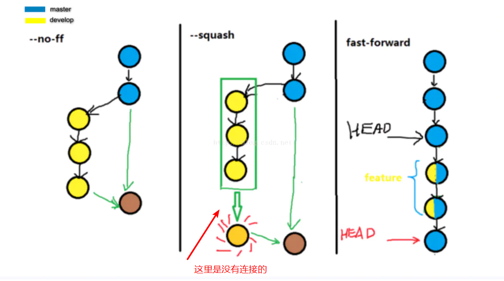
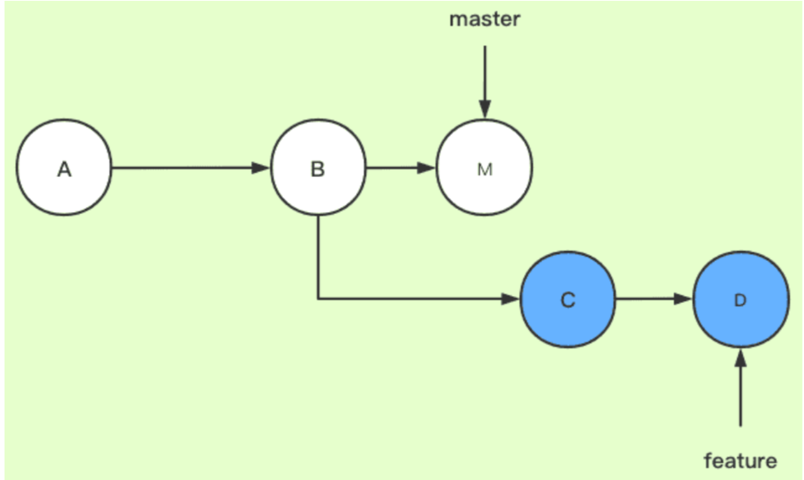

# git 使用

*学习git的基本使用*

## 1. 创建仓库

### 方式 1 git init

*任意建立一个文件夹，右键git bash, 输入git init将会在创建当前文件夹为一个本地git仓库*

> $ mkdir test  
> $ cd test   
> $ git init  


### 方式 2 git clone 


*直接将git仓库中的在线仓库克隆到本地*

> $ git clone xxxxx  

*xxxxx是你在仓库复制的链接，如下图所示*


## 2. 本地库基本操作
### git add

> $ git add+文件名.文件类型

*例如，我在文件夹里添加了一个test.txt，
也就是说我修改了test.txt，所以我在Git
Bash中可以写git add test.txt 来添加我的修改记录。但是你发现上一条git
add test.txt失败了，因为我在本地仓库中从没对这个进行我操作，所以没有修改记录，因此无法添加修改记录。*

> git add -A    # 提交所有变换    
> git add -u    # 提交被修改和被删除的文件  
> git add .     # 提交新文件和被修改的文件(**不包括被删除的文件**)

### git diff
**查看文档变换**
> git diff &emsp;# 查看所有文档变化<br>
> git diff 文件名.文件类型   &emsp; # 查看某个文件的变化<br>   

### cat 文件名.文件类型
    查看该文件内容

### git reset --soft HEAD^(或者版本号)
```
首先使用 git log 查看版本号 
如果输出太多 可以使用 git log --pretty=oneline

HEAD^的意思是上一个版本，也可以写成HEAD~1
如果你进行了2次commit，想都撤回，可以使用HEAD~2

--mixed 
意思是：不删除工作空间改动代码，撤销commit，并且撤销git add . 操作
这个为默认参数,git reset --mixed HEAD^ 和 git reset HEAD^ 效果是一样的。
 
--soft  
不删除工作空间改动代码，撤销commit，不撤销git add . 
 
--hard
删除工作空间改动代码，撤销commit，撤销git add . 

注意完成这个操作后，就恢复到了上一次的commit状态。

顺便说一下，如果commit注释写错了，只是想改一下注释，只需要：
git commit --amend

此时会进入默认vim编辑器，修改注释完毕后保存就好了
```

**回退后要返回最新版本**
> git reset --hard 最新版本的版本号

*如何已经关闭了命令行窗口，无法查看之前git log的版本号*
> git reflog # 查看之前的提交和回退记录

### git merge

在开发的过程中，一般不会在主分支直接开发，会在主分支master基础上新建一个develop分支，在develop上开发完成后合并在master分支，这时会用到`git merge`命令。

`git merge`有三种用法，`git merge --ff`即fast-forword方式，`git merge`默认使用使用fast-forward方式，



--fast-forward

Git 合并两个分支时，如果顺着一个分支走下去可以到达另一个分支的话，那么 Git 在合并两者时，只会简单地把指针右移，叫做“快进”（fast-forward）不过这种情况如果删除分支，则会丢失merge分支信息。（直接移动master的HEAD到合并的分支）

–squash

把一些不必要commit进行压缩，比如说，你的feature在开发的时候写的commit很乱，那么我们合并的时候不希望把这些历史commit带过来，于是使用–squash进行合并，此时文件已经同合并后一样了，但不移动HEAD，不提交。需要进行一次额外的commit来“总结”一下，然后完成最终的合并。（将代码修改合并到master，需要自己进行commit）

–no-ff

关闭fast-forward模式，在提交的时候，会创建一个merge的commit信息，然后合并的和master分支。（在master创建新的commit，merge的内容就会合并到新建的commit）

[git merge和git merge --no-ff的区别 - 简书 (jianshu.com)](https://www.jianshu.com/p/418323ed2b03)

### git rebase 

参考 [git rebase详解](https://www.cnblogs.com/zhoug2020/p/16649066.html)



在feature分支执行`git rebase master`或者`git rebase master feature`，进行变基

 feature：待变基分支、当前分支
 master：基分支、目标分支

这里目的还是要把master的内容合并到当前分支

当执行rebase操作时，git会**从两个分支的共同祖先开始提取待变基分支上的修改**，然后**将待变基分支指向基分支的最新提交**，最后将刚才提取的修改应用到基分支的最新提交的后面。


**git 取消合并**

> ```bash
> git merge --abort
> ```


### git stash

当再一个分支工作到一半时想切换到另一个分支，又不想提交或者丢弃当前分支修改的部分，可以使用 `git stash`暂存本分支的修改。

- 暂存分支

```bash
git stash # 暂存分支修改部分，此时使用git status会显示没有修改

git stash save "保存的信息"

git stash -u # 暂存修改和添加的新文件

git stash -a # 暂存所有变动
```

- 查看暂存分支

`git stash list` 列出暂存的分支

`git stash show` 查看最近暂存分支的文件的修改情况

在该命令后面添加`-p`或`--patch`可以查看特定stash的全部diff，

- 还原暂存的分支

`git stash apply` 默认还原最近暂存

也可以加上 `stash@{0}`指定还原的暂存

- 删除暂存

可以通过 `git stash pop` 或者 `drop` 命令删除对应的缓存数据。

```bash
git stash drop stash@{1}        # 删除 stash@{1} 分支对应的缓存数据
git stash pop                   # 将最近一次暂存数据恢复并从栈中删除
```

- 从stash创建分支

`git stash branch testchanges`


### git rm

当需要删除暂存区或分支上的文件，**同时工作区不需要这个文件**

> git rm fileName

当需要删除暂存区或分支上的文件，**同时工作区需要这个文件，但是不需要被版本控制**

> git rm *--cache fileName* 
>
> 后面添加进.gitignore文件中的文件可以使用这条命令解除版本控制的追踪，然后在commit忽略这个文件。

## 3. 链接远程仓库 

[详细说明点这里](https://www.runoob.com/git/git-remote-repo.html)
由于你的本地 Git 仓库和 GitHub 仓库之间的传输是通过SSH加密的，所以我们需要配置验证信息：
使用以下命令生成 SSH Key：

> ssh-keygen -t rsa -C "youremail@example.com"

后面的 your_email@youremail.com 改为你在 Github 上注册的邮箱，之后会要求确认路径和输入密码，我们这使用默认的一路回车就行。成功的话会在 ~/ 下生成 .ssh 文件夹，进去，打开 id_rsa.pub，复制里面的 key。

回到 github 上，进入 Account => Settings（账户配置）=> SSH and GPG keys => NEW SSH key。


- 方式1 https地址
> 优点：可以直接复制图中的地址进行连接  
> 缺点： 每次连接都需要登录自己的github账号
- 方式2 ssh地址
> 优点：只需登录一次  
> 缺点： 须在本地和git仓库进行配置

**具体步骤**

1. 链接远程仓库 
> git remote add [shortname] [url]  
eg: 
> git remote add origin git@github.com:tingmwu/python_learn.git       

2. 查看远程库
> git remote -v

3. 提交修改并上传
> git add -A    # 增加修改  
> git commit -m '你的备注信息' # 提交修改

4. 进行同步

> git push -u origin master

    *由于远程库是空的，我们第一次推送master分支时，加上了 –u参数，Git不但会把本地的master分支内容推送的远程新的master分支，还会把本地的master分支和远程的master分支关联起来，在以后的推送或者拉取时就可以简化命令，只输入（如下）就OK。*

> git push origin master

​     

<!-- <meta http-equiv="refresh" content="5"> -->

## 4. git同时推送多个远程仓库
### 方法1
> git remote set-url --add origin https://github.com/demo.git(新增的远程库链接)

### 方法2
**修改.git/config**

```bash
[remote "origin"]
	url = git@gitee.com:tingmwu/gray-segment.git
    url = 新的远程库链接
	fetch = +refs/heads/*:refs/remotes/origin/*
```

## 5. 补充

### 1. 查看当前所在的Git仓库

```bash
git rev-parse --show-toplevel
```

### 2. git手动解决冲突

参考：[解决Git merge时的冲突](https://myronji.github.io/2018/01/14/%E8%A7%A3%E5%86%B3Git-merge%E6%97%B6%E7%9A%84%E5%86%B2%E7%AA%81/)

两种情况：

- pull的分支和本地提交的分支修改了同一个文件

  可以打开冲突的文件，手动修改文件处理冲突，<< <<   ====之间的部分是本地修改，     ==    >>>>之间的部分是远程修改的内容。

  直接选择保留本地或者远程文件：

  ```bash
  git checkout --ours/--theirs xxx.c # --ours为保留本地文件，--theirs为保留远程文件
  # 也可以直接 git checkout --ours/--theirs . 对所有冲突的文件进行选择
  ```

- 删除本地文件或者保留本地文件

  使用`git rm`来删除本地文件。

  如果要保留本地文件则可以用`git checkout --ours`来保留。

所有冲突解决之后就可以使用 `git commit -am "xxx"`提交合并
