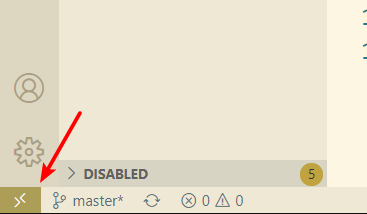

# ubuntu换源问题

## apt 更换国内源

> *修改 /etc/apt/sources.list 文件即可，将内容更换为任意一种国内源即可*

*国内源*

### 1.阿里源

```
deb-src http://archive.ubuntu.com/ubuntu xenial main restricted #Added by software-properties
deb http://mirrors.aliyun.com/ubuntu/ xenial main restricted
deb-src http://mirrors.aliyun.com/ubuntu/ xenial main restricted multiverse universe #Added by software-properties
deb http://mirrors.aliyun.com/ubuntu/ xenial-updates main restricted
deb-src http://mirrors.aliyun.com/ubuntu/ xenial-updates main restricted multiverse universe #Added by software-properties
deb http://mirrors.aliyun.com/ubuntu/ xenial universe
deb http://mirrors.aliyun.com/ubuntu/ xenial-updates universe
deb http://mirrors.aliyun.com/ubuntu/ xenial multiverse
deb http://mirrors.aliyun.com/ubuntu/ xenial-updates multiverse
deb http://mirrors.aliyun.com/ubuntu/ xenial-backports main restricted universe multiverse
deb-src http://mirrors.aliyun.com/ubuntu/ xenial-backports main restricted universe multiverse #Added by software-properties
deb http://archive.canonical.com/ubuntu xenial partner
deb-src http://archive.canonical.com/ubuntu xenial partner
deb http://mirrors.aliyun.com/ubuntu/ xenial-security main restricted
deb-src http://mirrors.aliyun.com/ubuntu/ xenial-security main restricted multiverse universe #Added by software-properties
deb http://mirrors.aliyun.com/ubuntu/ xenial-security universe
deb http://mirrors.aliyun.com/ubuntu/ xenial-security multiverse
```

### 2.东北大学
```
deb-src http://mirror.neu.edu.cn/ubuntu/ xenial main restricted #Added by software-properties

deb http://mirror.neu.edu.cn/ubuntu/ xenial main restricted

deb-src http://mirror.neu.edu.cn/ubuntu/ xenial restricted multiverse universe #Added by software-properties

deb http://mirror.neu.edu.cn/ubuntu/ xenial-updates main restricted

deb-src http://mirror.neu.edu.cn/ubuntu/ xenial-updates main restricted multiverse universe #Added by software-properties

deb http://mirror.neu.edu.cn/ubuntu/ xenial universe

deb http://mirror.neu.edu.cn/ubuntu/ xenial-updates universe

deb http://mirror.neu.edu.cn/ubuntu/ xenial multiverse

deb http://mirror.neu.edu.cn/ubuntu/ xenial-updates multiverse

deb http://mirror.neu.edu.cn/ubuntu/ xenial-backports main restricted universe multiverse

deb-src http://mirror.neu.edu.cn/ubuntu/ xenial-backports main restricted universe multiverse #Added by software-properties

deb http://archive.canonical.com/ubuntu xenial partner deb-src http://archive.canonical.com/ubuntu xenial partner

deb http://mirror.neu.edu.cn/ubuntu/ xenial-security main restricted

deb-src http://mirror.neu.edu.cn/ubuntu/ xenial-security main restricted multiverse universe #Added by software-properties

deb http://mirror.neu.edu.cn/ubuntu/ xenial-security universe

deb http://mirror.neu.edu.cn/ubuntu/ xenial-security multiverse
```
### 3.清华大学
```
deb http://mirrors.tuna.tsinghua.edu.cn/ubuntu/ xenial main restricted

deb http://mirrors.tuna.tsinghua.edu.cn/ubuntu/ xenial-updates main restricted

deb http://mirrors.tuna.tsinghua.edu.cn/ubuntu/ xenial universe

deb http://mirrors.tuna.tsinghua.edu.cn/ubuntu/ xenial-updates universe

deb http://mirrors.tuna.tsinghua.edu.cn/ubuntu/ xenial multiverse

deb http://mirrors.tuna.tsinghua.edu.cn/ubuntu/ xenial-updates multiverse

deb http://mirrors.tuna.tsinghua.edu.cn/ubuntu/ xenial-backports main restricted universe multiverse

deb http://mirrors.tuna.tsinghua.edu.cn/ubuntu/ xenial-security main restricted

deb http://mirrors.tuna.tsinghua.edu.cn/ubuntu/ xenial-security universe deb http://mirrors.tuna.tsinghua.edu.cn/ubuntu/ xenial-security multiverse
```
## pip更换国内源

> *linux下 Linux下，修改 ~/.pip/pip.conf。*
```
[global]
index-url = https://pypi.tuna.tsinghua.edu.cn/simple

[install]
trusted-host=mirrors.aliyun.com
```
> *windows下，直接在user目录中创建一个pip目录，如：C:\Users\xx\pip，新建文件pip.ini。内容同上。*


> 临时使用 ， pip install -i https://pypi.tuna.tsinghua.edu.cn/simple package

*其他国内源*
清华：https://pypi.tuna.tsinghua.edu.cn/simple

阿里云：http://mirrors.aliyun.com/pypi/simple/

中国科技大学 https://pypi.mirrors.ustc.edu.cn/simple/

华中理工大学：http://pypi.hustunique.com/

山东理工大学：http://pypi.sdutlinux.org/ 

豆瓣：http://pypi.douban.com/simple/


# VS code通过SSH远程编辑服务器文件
## 1. 安装ssh环境
> open ssh，win10可打开设置=>应用=>管理可选功能=>安装open sss客户端和服务器端
    设置里找不到可[通过powershell安装](https://docs.microsoft.com/zh-cn/windows-server/administration/openssh/openssh_install_firstuse)

> 或者如果有git自带ssh，那么直接使用git

## 2. 生成公钥
> 1. 建立ssh信任(确认自己本机的公钥是否存在%USERPROFILE%\.ssh\id_rsa.pub,不存在就生成,命令是ssh-keygen -t rsa,然后传递给远程,ssh-copy-id username_on_host@host_ip)

> 2. 打开Remote-SSH: Open Configuration File...,然后配置文件内容,例如

Host root
    HostName 47.97.221.121
    Port 22
    User root
    IdentityFile C:\Users\tmdd\.ssh\id_rsa

> 3. 然后把公钥id_rsa.pub的内容追加到服务器/home/.ssh/authorized_keys文件里。然后重启vscode就会发现无需在输入密码了

## 3. vs code连接
> 1. 安装Remote SSH插件

> 2. 点击左下角一个对尖括号标志



> 3. 选择connect host之后就可以操作了
