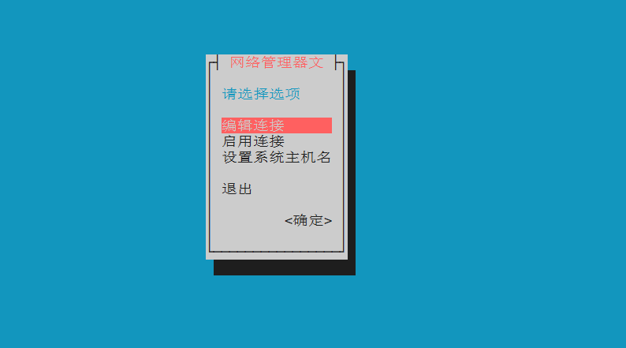

# linux网络配置

> 本文讲的linux下网络配置主要是指没有图形界面的情况下（远程ssh、server版本）对Linux进行有线或无线网络的配置。

### 配置文件方法

#### WPA-SUPPLICANT

1. 生成wifi连接配置文件
```sh
wpa_passphrase < SSID > < PASSWORD > <CONFIG_FILE> # CONFIG_FILE为生成的配置文件名，默认存储在/etc/
```
example: 
```sh
wpa_passphrase Virus LinuxFTW > wpa.conf
```


the data of the wpa.conf file shoule be something like this
```bash
network={  
        ssid="Virus"  
        #psk="LinuxFTW"  
        psk=1d538d505f48205589ad25b2ca9f52f9cbb67687e310c58a8dd940ccc03fbfae  
}  
```
2. 查看drivers信息
```sh
wpa_supplicant
```

将会显示以下的drivers信息
```sh
drivers:
nl80211 = Linux nl80211/cfg80211
wext = Linux wireless extensions (generic)
wired = Wired Ethernet driver
none = no driver (RADIUS server/WPS ER)
```
3. 启动配置
```sh
wpa_supplicant -iINTERFACE_NAME -cCONFIGURATION_FILE -DDRIVER_NAME 
```
example:
```sh
wpa_supplicant -iwlan0 -c/etc/wpa_supplicant.conf -Dwext
````

> After that simply do a `sudo dhclient wlan0` to get an IP from the router.

> More information about this in `man wpa_supplicant.conf`


4. dhcp分配ip地址

> iw dev wlan0 link # 查看设备是否连接成功
>
> dhcpcd wlan0 # 如果设备连接成功但还是没有ip地址，可以使用dpcpcd分配ip

[[How to connect and disconnect to a network manually in terminal?](https://askubuntu.com/questions/16584/how-to-connect-and-disconnect-to-a-network-manually-in-terminal)](https://askubuntu.com/questions/16584/how-to-connect-and-disconnect-to-a-network-manually-in-terminal)

[[SOLVED\]wpa_supplicant authentication failing (for no obvious reasons)](https://bbs.archlinux.org/viewtopic.php?id=218671)

#### 配置/etc/network/interfaces 

```sh
auto lo
iface lo inet loopback

# 默认情况这里只有测试网络lo ,要想在interface管理其他类型的网络，在下面配置即可，前提是NetworkManager.conf 中managed=false，不然这里不会起效。

# 以太网 动态配置 
auto eth0
iface eth0 inet dhcp

# 以太网 静态配置
auto eth0
iface eth0 inet static
　　address 192.168.0.42
　　network 192.168.0.0
　　netmask 255.255.255.0
　　broadcast 192.168.0.255 # 可有可无
　　gateway 192.168.0.1

无线网络配置 WiFi

auto wlan0
iface wlan0 inet dhcp
　　
auto wlan0
iface wlan0 inet dhcp
　　wpa-ssid “TP-LINK_8D0B8A”
　　wpa-psk “12345678”
```

[Linux的有线网络 无线网络连接配置与解决方案](https://blog.csdn.net/CSDNhuaong/article/details/77925306)

### 使用network-manager

nmcli和nmtui是network-manager下的网络管理工具，首先安装network-manager

> sudo apt install network-manager

#### nmtui工具

命令行输入nmtui，会显示一个图形界面，在图形界面可以进行有线和无线网络的添加和启用；




####  nmcli工具

相比于nmtui图形界面工具，nmcli是纯命令行，但是nmcli可以更加灵活的进行网络的配置和管理；

1. 网络扫描

```shell
nmcli # 直接显示现有网络设备和连接情况
nmcli dev # 显示网络设备，可以看到有线网络设备和无线网络设备名称
```

2. 有线网络连接

```sh
# eth0使用HDCP分配IP
nmcli con add type ethernet autoconnect no ifname eth0 # eth0是你的有线网卡设备名称

# eth0手动设置IP
nmcli con add type ethernet autoconnect yes ifname eth0 ipv4.addr "192.168.0.0/24" ipv4.method manual

# nmcli创建热点
nmcli device wifi hotspot ifname wlan0 con-name MyHostspot ssid MyHostspotSSID password 12345678

nmcli connection add type ethernet ifname enp5s0    # 创建一个连接。这里没有指定method，则默认使用auto，也就是自动配置。类型是以太网，类型有以太网、wifi，adsl等，具体参考文章头部给的url
nmcli connection add ifname enp5s0 autoconnect yes type ethernet ip4 10.1.1.1/8 gw4 10.1.0.1    # 创建一个静态ip的以太网连接

nmcli connection modify  myEth +ipv4.dns 8.8.8.8    # 给myEth的配置添加dns
nmcli connection modify  myEth ipv4.method manual  ipv4.addresses "192.168.43.64/24,10.0.0.23/8"   #修改myEth连接为手动，ip地址设置为两个
nmcli con mod myEth  autoconnect no     # 设置myEth连接配置为不自动连接(重启操作系统或从起NetworkManager就能看到不会自动连接了)
```

3. 无线网络连接

```sh
# 1. 网络扫描
nmcli dev(ice) wifi # 显示所有可用wifi，dev(ice) 表示可以写成device，也可以简写为dev，后面写法相同

sudo iw(list) wlan0 scan | grep ESSID # 这条命令适合已经连接wifi时，使用上一条命令只能看到已连接wifi时使用，wlan0为你的无线网卡名称

# 2. 添加wifi
nmcli dev wifi con(nect) <ESSID_NAME > password <wifi password>

# 3.查看wifi连接信息
nmcli connection show  # 列出网络连接的配置(存放于内存和硬盘的配置，nmcli -f active connection show 表示显示存储于内存配置， -f profile表示存放于硬盘的配置)

nmcli connection show --active  # 仅列出处于活动状态的网络配置

nmcli --show-secrets -f  802-11-wireless-security.psk  connection show  myAP001  # 显示myAP001密码，加了--show-secrets或-s才能显示密码明文

nmcli connection show --order name # 按配置名排序，可选排序有type、active、name、path(d-bus路径)，+号和-号表示升序和降序，未指定，则默认使用升序。默认排序是：--order active:name:path

nmcli connection show uuid 38781e62-4bab-4ba8-a086-bfaece222794  # 按指定关键字显示，关键字有id，uuid、path、apath。 用途是不能使用常规的nmcli connection show <配置名> 来显示的时候，这种显示方法就可以派上用场了。

# 4. 切换和删除wifi
nmcli connection up prof1        # 激活一个连接，可用于在已保存的几个wifi中进行切换
nmcli connection down prof1   # 停用一个连接
nmcli dev dis wlan0 # 断开当前wifi连接，用于切换wifi，但不删除配置，停用之后可以重新搜索连接其它wifi
nmcli connection del(ete) prof1 #删除一个配置， delete [ id | uuid | path ] ID...
```


[nmcli命令详解(创建热点，连接wifi，管理连接等)](https://www.cnblogs.com/mind-water/p/12079647.html)

[NetworkManager——nmcli命令连接WIFI、以太网和创建热点_培培哥的专栏-程序员宅基地_nmcli连接wifi](https://www.cxyzjd.com/article/u014695839/84554606)

[NetworkManager——nmcli命令连接WIFI、以太网和创建热点](https://blog.csdn.net/u014695839/article/details/84554606)

