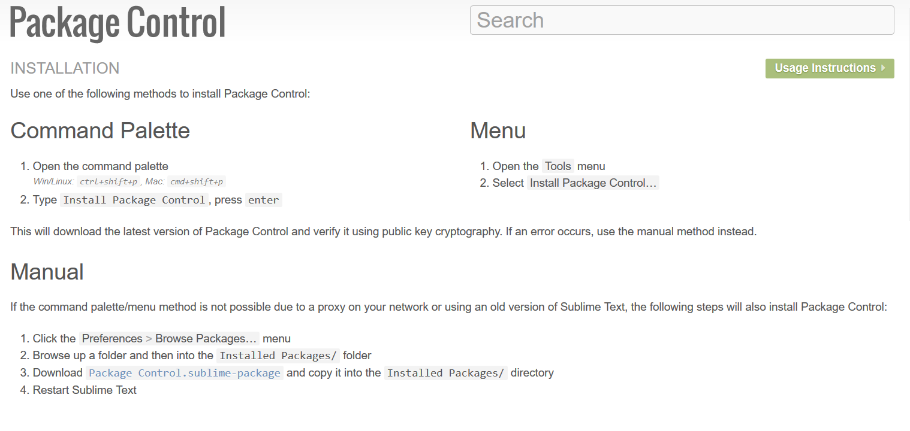

# sublime的安装配置及python环境的搭建

<!-- ## sublime text 3的安装 -->
## 1. [官网下载地址](https://www.sublimetext.com/3)
下载安装即可!(**注意勾选添加软件到系统路径**)
## 2. 进行基本设置
*点击上方工具栏preferences->setting即可进行sublime的设置<br>
点击上方工具栏preferences->key buildings即可进行快捷键绑定<br>
点击上方工具栏preferences->theme即可更换主题<br>*

**基本设置缩进、行号、主题等**
```   
[
    "color_scheme": "Packages/Material Theme/schemes/Material-Theme-Darker.tmTheme",
    "expand_tabs_on_save": true,
    "font_size": 14,
    "ignored_packages":
    [
        "Markdown",
        "Vintage"
    ],
    "tab_size": 4,
    "theme": "Material-Theme-Darker.sublime-theme",
    "translate_tabs_to_spaces": true,

    "word_wrap": true,
    "wrap_width": 80,
]
```
**key buildings设置**

```
[
    // 编译设置
    { "keys": ["f5"], "command": "build" },
    { "keys": ["shift+f5"], "command": "build", "args": {"select": true} },

    // markdown键位设置
    { "keys": ["alt+m"], "command": "markdown_preview", "args": {"target": "browser", "parser":"markdown"} },
    // 工具栏设置
    { "keys": ["ctrl+tab"], "command": "toggle_side_bar" },

    // 插件设置
    {"command": "anaconda_doc", "keys": ["ctrl+q"], "context": [
                {"key": "selector", "operator": "equal", "operand": "source.python"}
            ]},
]
```


## 3. 安装包
> 方式1: 安装package install管理工具<br>
> 方式2: 在[package网站](https://packagecontrol.io/)下载后放到本地的package文件夹下

### 安装package install 工具
打开[pakage control的网站](https://packagecontrol.io/installation)



## 4. 其他问题

### 1. sublime启动时弹出Anaconda错误提示框
*进入Prefence->Package Settings->Anaconda->settings-user*
>"swallow_startup_errors": false,

### 2. markdown编辑界面左侧有空白区
*进入Prefence->Package Settings->Markdown Editing->Markdown GFM settings-user*
```
{
    "color_scheme": "Packages/Material Theme/schemes/Material-Theme-Darker.tmTheme",
    "draw_centered": false,
    "line_numbers": true,
}
```


